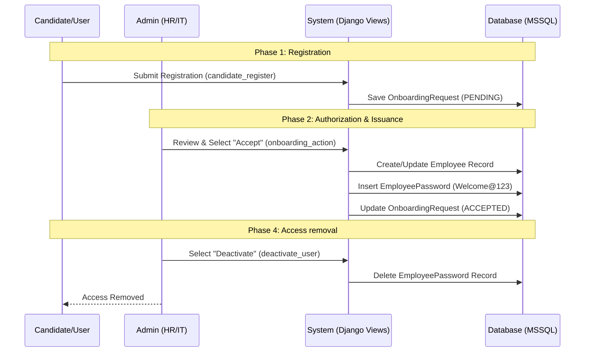
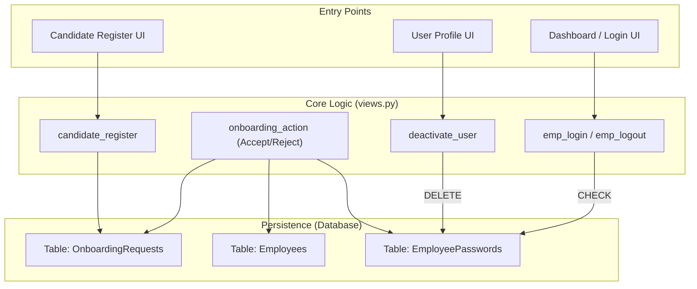

# Architecture Diagram: User Lifecycle Management

This diagram illustrates the user registration, authorization, and credential removal lifecycle within the HRMS.

## 1. User Lifecycle Flow

## 2. Interaction Model

## 3. Control Descriptions
- **onboarding_action**: The gateway for system access. Ensures a formal record exists BEFORE credentials are issued.
- **deactivate_user**: The kill-switch for system access. Deleting the `EmployeePassword` entry ensures the `emp_login` function will fail authentication immediately.
- **emp_login**: The enforcement point. It joins `Employees` with `EmployeePasswords` to verify both existence and credentials.
